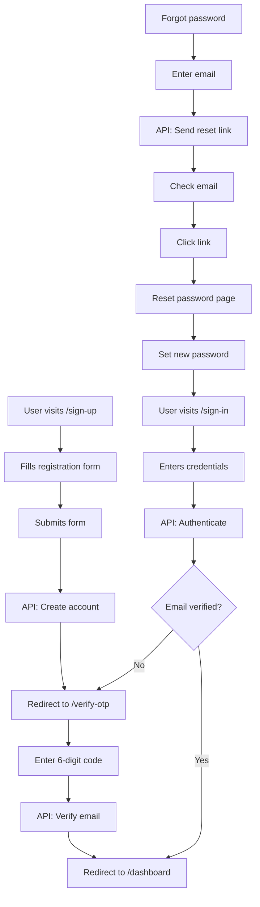

# 🔐 Authentication Setup Documentation

Complete authentication UI with beautiful mesh gradient animations and modern form designs.

## ✨ Overview

The authentication system includes:
- **Split-screen design** with animated mesh gradients
- **Responsive layouts** for all screen sizes
- **Modern forms** with validation and loading states
- **OTP verification** with 6-digit code input
- **Password reset flow** with email confirmation
- **Social login** placeholders (Google, GitHub)

## 📱 Pages Created

### 1. Sign Up (`/sign-up`)
**Purpose:** New user registration

**Features:**
- Email and password input
- Password visibility toggle
- Password strength hint
- Terms & Privacy checkbox (required)
- Newsletter subscription checkbox (optional)
- Form validation
- Loading states
- Link to sign in

**Form Fields:**
```typescript
{
  email: string;
  password: string;
  agreeToTerms: boolean;
  subscribeNewsletter: boolean;
}
```

### 2. Sign In (`/sign-in`)
**Purpose:** User authentication

**Features:**
- Email and password input
- Password visibility toggle
- "Remember me" checkbox
- Forgot password link
- Social login buttons (Google, GitHub)
- Form validation
- Loading states
- Link to sign up

**Form Fields:**
```typescript
{
  email: string;
  password: string;
  rememberMe: boolean;
}
```

### 3. OTP Verification (`/verify-otp`)
**Purpose:** Email verification with one-time password

**Features:**
- 6-digit OTP input (auto-focus, auto-advance)
- Paste support (auto-fills all 6 digits)
- Keyboard navigation (arrows, backspace)
- Resend code with 60s cooldown
- Loading states
- Visual feedback for filled digits
- Back to sign in link

**Form Fields:**
```typescript
{
  otp: string[6]; // Six individual digits
}
```

### 4. Forgot Password (`/forgot-password`)
**Purpose:** Request password reset

**Features:**
- Email input
- Success confirmation screen
- Resend instructions option
- Back to sign in link
- Loading states

**Form Fields:**
```typescript
{
  email: string;
}
```

## 🎨 Design System

### Mesh Gradient Animation
- **Left side:** Animated mesh gradient background
- **Right side:** Clean white/dark form area
- **Colors (Light mode):** Warm peach/coral tones
- **Colors (Dark mode):** Purple/lavender tones
- **Animation:** Smooth, continuous movement (1.2x speed)

### Layout Structure
```
┌─────────────────────────────────────┐
│  Mesh Gradient   │   Form Content   │
│  (50% width)     │   (50% width)    │
│                  │                  │
│  - Logo          │   - Mobile logo  │
│  - Title         │   - Form title   │
│  - Subtitle      │   - Form fields  │
│  - Features      │   - Submit btn   │
│                  │   - Links        │
└─────────────────────────────────────┘
     Desktop View

┌─────────────────┐
│  Mobile Logo    │
│                 │
│  Form Content   │
│  (Full width)   │
│                 │
│  - Form title   │
│  - Form fields  │
│  - Submit btn   │
│  - Links        │
└─────────────────┘
   Mobile View
```

## 📂 File Structure

```
src/
├── app/(auth)/                           # Auth route group
│   ├── sign-up/
│   │   └── page.tsx                      # Sign up page
│   ├── sign-in/
│   │   └── page.tsx                      # Sign in page
│   ├── verify-otp/
│   │   └── page.tsx                      # OTP verification page
│   └── forgot-password/
│       └── page.tsx                      # Forgot password page
│
├── layouts/auth/
│   ├── auth-layout.tsx                   # Shared auth layout with gradient
│   └── components/
│       ├── sign-up-form.tsx              # Sign up form component
│       ├── sign-in-form.tsx              # Sign in form component
│       ├── verify-otp-form.tsx           # OTP form component
│       └── forgot-password-form.tsx      # Forgot password form component
│
├── api/
│   └── auth.api.ts                       # Auth API service (ready to connect)
│
└── hooks/
    └── use-is-dark.ts                    # Theme detection hook
```

## 🔧 Components

### AuthLayout
**Purpose:** Shared layout wrapper for all auth pages

**Props:**
```typescript
interface AuthLayoutProps {
  children: React.ReactNode;
  title?: string;        // Left side main title
  subtitle?: string;     // Left side subtitle
}
```

**Features:**
- Mesh gradient animation (client-side only)
- Responsive logo positioning
- Theme-aware gradient colors
- Feature list display
- Mobile-optimized layout

### Form Components
All form components follow the same pattern:

**State Management:**
```typescript
const [email, setEmail] = useState("");
const [password, setPassword] = useState("");
const [isLoading, setIsLoading] = useState(false);
```

**Validation:**
- Client-side validation before submission
- Disabled submit button when invalid
- Visual feedback for errors

**Loading States:**
- Loading spinner in button
- Disabled inputs during submission
- Changed button text

## 🚀 Usage Examples

### Basic Sign Up
```tsx
import { AuthLayout } from "@/layouts/auth/auth-layout";
import { SignUpForm } from "@/layouts/auth/components/sign-up-form";

export default function SignUpPage() {
  return (
    <AuthLayout
      title="Welcome to Ragnarock"
      subtitle="Sign up for free to access powerful tools"
    >
      <SignUpForm />
    </AuthLayout>
  );
}
```

### Customizing Gradient Colors
Edit `auth-layout.tsx`:
```typescript
const gradientColors: [string, string, string, string] = isDark
  ? ["#yourColor1", "#yourColor2", "#yourColor3", "#yourColor4"]
  : ["#lightColor1", "#lightColor2", "#lightColor3", "#lightColor4"];
```

## 🔌 API Integration

### 1. Update API Base URL
```env
# .env.local
NEXT_PUBLIC_API_URL=https://your-api.com/api
```

### 2. Connect Sign Up Form
Edit `sign-up-form.tsx`:
```typescript
import { signUp } from "@/api/auth.api";

const handleSubmit = async (e: React.FormEvent) => {
  e.preventDefault();
  setIsLoading(true);

  try {
    const response = await signUp({
      email,
      password,
      subscribeNewsletter,
    });
    
    // Store token
    localStorage.setItem('authToken', response.token);
    
    // Redirect to OTP verification
    router.push('/verify-otp');
  } catch (error) {
    console.error('Sign up failed:', error);
    // Show error message to user
  } finally {
    setIsLoading(false);
  }
};
```

### 3. Available API Functions

```typescript
// Sign up
await signUp({ email, password, name?, subscribeNewsletter? })

// Sign in
await signIn({ email, password, rememberMe? })

// Sign out
await signOut()

// Verify OTP
await verifyOtp({ email, otp })

// Resend OTP
await resendOtp(email)

// Forgot password
await forgotPassword({ email })

// Reset password
await resetPassword({ token, password })

// Get current user
await getCurrentUser()

// Refresh token
await refreshToken(refreshToken)
```

## 🎯 Features Implemented

### ✅ Sign Up
- [x] Email/password registration
- [x] Password strength validation (8+ chars)
- [x] Terms & privacy acceptance
- [x] Newsletter subscription option
- [x] Loading states
- [x] Form validation
- [x] Link to sign in

### ✅ Sign In
- [x] Email/password login
- [x] Remember me option
- [x] Password visibility toggle
- [x] Forgot password link
- [x] Social login UI (Google, GitHub)
- [x] Loading states
- [x] Link to sign up

### ✅ OTP Verification
- [x] 6-digit code input
- [x] Auto-focus and auto-advance
- [x] Paste support
- [x] Keyboard navigation
- [x] Resend with cooldown (60s)
- [x] Loading states
- [x] Visual feedback

### ✅ Forgot Password
- [x] Email input
- [x] Success confirmation
- [x] Resend option
- [x] Loading states
- [x] Back navigation

### ✅ UI/UX
- [x] Mesh gradient animations
- [x] Responsive design
- [x] Dark mode support
- [x] Loading states
- [x] Form validation
- [x] Accessibility (labels, focus states)
- [x] Smooth transitions

## 🎨 Customization

### Change Brand Colors
```typescript
// auth-layout.tsx
const gradientColors: [string, string, string, string] = isDark
  ? ["#YourDark1", "#YourDark2", "#YourDark3", "#YourDark4"]
  : ["#YourLight1", "#YourLight2", "#YourLight3", "#YourLight4"];
```

### Update Logo
```tsx
// auth-layout.tsx - Line ~63
<div className="flex aspect-square size-10 items-center justify-center...">
  <YourLogoComponent />
</div>
```

### Customize Feature List
```tsx
// auth-layout.tsx - Line ~91
{[
  "Your custom feature 1",
  "Your custom feature 2",
  "Your custom feature 3",
].map((feature, index) => (
  // ... render feature
))}
```

### Add More Social Providers
```tsx
// sign-in-form.tsx
<Button variant="outline">
  <YourProviderIcon />
  Provider Name
</Button>
```

## 🔒 Security Considerations

### Current Implementation
- ✅ Password minimum length (8 chars)
- ✅ HTTPS ready (use in production)
- ✅ No credentials in localStorage yet (TODO)
- ✅ CSRF protection ready

### TODO for Production
- [ ] Implement JWT token storage (httpOnly cookies recommended)
- [ ] Add reCAPTCHA or similar bot protection
- [ ] Implement rate limiting on forms
- [ ] Add CSRF tokens
- [ ] Enable secure, httpOnly cookies
- [ ] Implement session management
- [ ] Add 2FA support (optional)
- [ ] Password strength meter
- [ ] Account lockout after failed attempts

## 📝 Next Steps

### 1. Backend Integration
```bash
# Update API endpoints to match your backend
src/api/endpoints.ts
```

### 2. Add Auth Context
```bash
# Create auth context for global state
src/contexts/auth-context.tsx
```

### 3. Implement Protected Routes
```bash
# Add middleware to protect dashboard routes
src/middleware.ts
```

### 4. Add Token Management
```bash
# Implement JWT storage and refresh logic
src/lib/auth.ts
```

### 5. Error Handling
```bash
# Add toast notifications for errors
pnpm add sonner
```

## 🎉 Complete Auth Flow



## 📚 Resources

- **Framer Motion (Motion):** [https://motion.dev](https://motion.dev)
- **Paper Design Shaders:** [@paper-design/shaders-react](https://www.npmjs.com/package/@paper-design/shaders-react)
- **shadcn/ui:** [https://ui.shadcn.com](https://ui.shadcn.com)
- **Next.js Authentication:** [https://nextjs.org/docs/authentication](https://nextjs.org/docs/authentication)

---

**Auth UI is ready! 🎊** Connect to your backend API and start authenticating users.